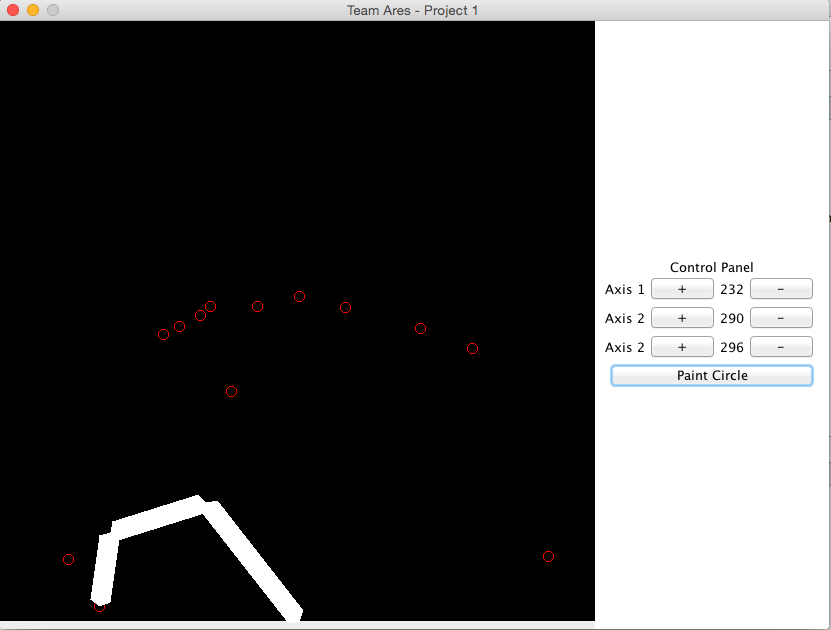
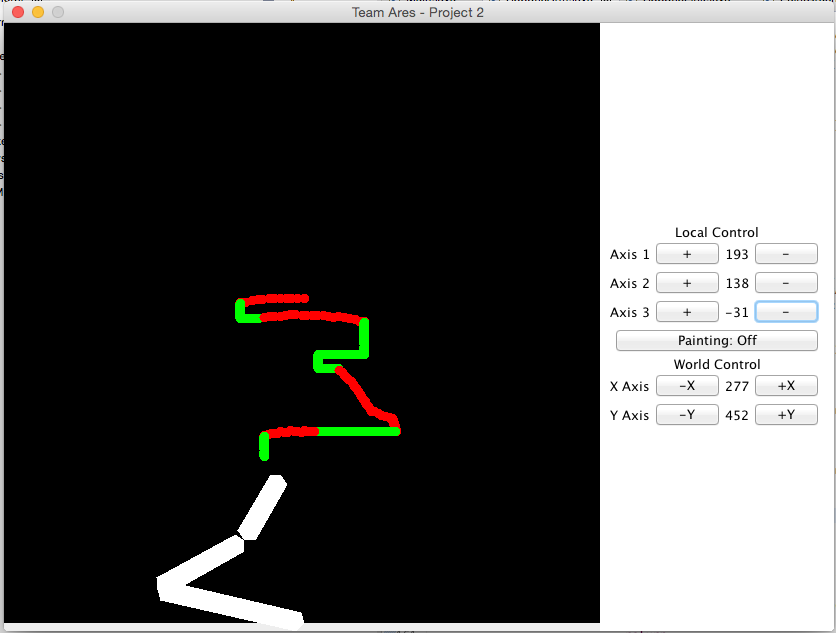
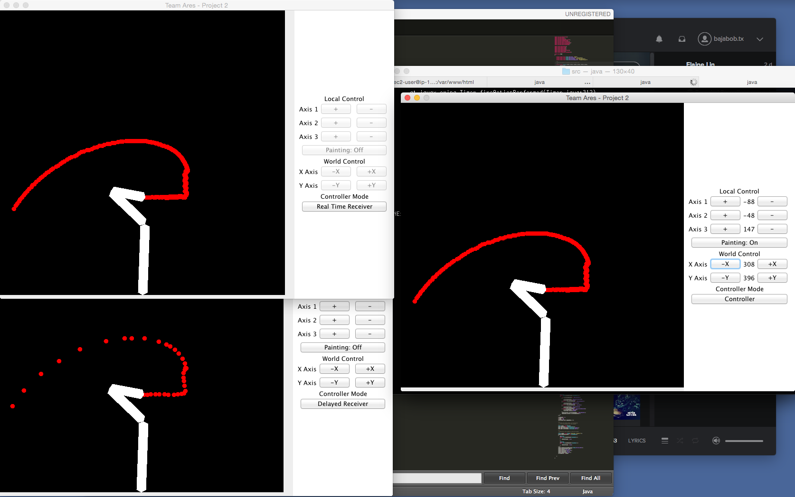

## CSCE-452-Project-1-to-3 Robotic Painting Arm
* Project 1: Forward Kinematics
* Project 2: Inverse Kinematics
* Project 3: Remote control using SQL, JSON, PHP and http GET (via AWS)

### Notes
This is a series of projects collected into one repo since each iteration of the project built upon the last. Using Java Swing I implemented a robotic arm with 3 DOF in 2D space to paint on an X/Y coordinate plane. This robot had to be capable of controlling each joint independently using forward kinematics. The arm also utilizes inverse kinematics to reach a desired point on a 2D plane. Lastly the arm must be able to receive remote commands from another instance of this client using a restful web service. 

### Compile & Run
* Checkout this repo to your local development environment
* Compile using `make`
* Run using `java Main`
* Note: The remote operations of this application must be configured for your remote PHP instance. Check out the `aws` folder for more information and update the application's source for your server's IP. 

### Screenshots

#### Project 1

#### Project 2

#### Project 3
* TOP LEFT: Receiving real-time commands from remote server
* BOTTOM LEFT: Receiving 2 second delayed commands from remote server
* RIGHT: Issuing commands to remote server
* For more information on our web API please see this repo: https://github.tamu.edu/bobtimm/CSCE-452-Project-3

### Plagiarism Notice
If you are working on an assignment for a University or High School course you must check with your professor and/or school's guidelines on plagiarism before copying any work found in this codebase. The author of this code is not to be held responsible for acts of cheating or misconduct. The author, much like the creator of a scholastic paper or article has decided to post this codebase for educational purposes. If you are a professor or course admin that is having an issue with cheating in your class, please feel free to contact the author.

### License
Copyright (c) 2015 Robert Timm

Permission is hereby granted, free of charge, to any person obtaining a copy of this software and associated documentation files (the "Software"), to deal in the Software without restriction, including without limitation the rights to use, copy, modify, merge, publish, distribute, sublicense, and/or sell copies of the Software, and to permit persons to whom the Software is furnished to do so, subject to the following conditions:

The above copyright notice and this permission notice shall be included in all copies or substantial portions of the Software.

THE SOFTWARE IS PROVIDED "AS IS", WITHOUT WARRANTY OF ANY KIND, EXPRESS OR IMPLIED, INCLUDING BUT NOT LIMITED TO THE WARRANTIES OF MERCHANTABILITY, FITNESS FOR A PARTICULAR PURPOSE AND NONINFRINGEMENT. IN NO EVENT SHALL THE AUTHORS OR COPYRIGHT HOLDERS BE LIABLE FOR ANY CLAIM, DAMAGES OR OTHER LIABILITY, WHETHER IN AN ACTION OF CONTRACT, TORT OR OTHERWISE, ARISING FROM, OUT OF OR IN CONNECTION WITH THE SOFTWARE OR THE USE OR OTHER DEALINGS IN THE SOFTWARE.
